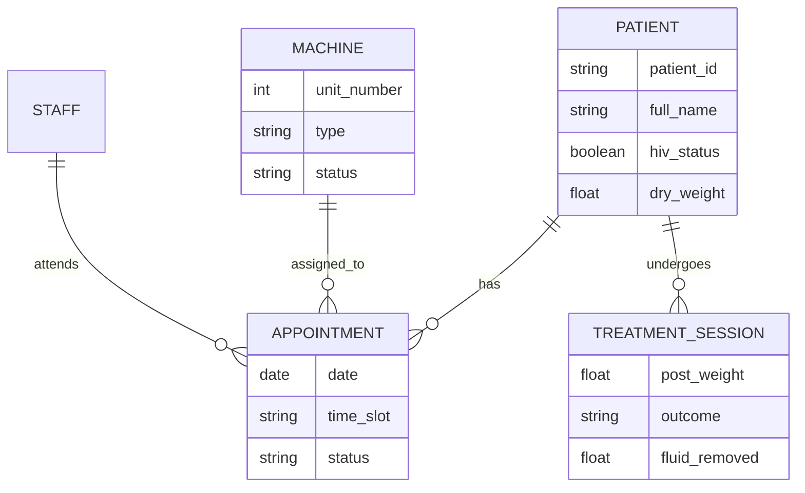

# Project Details: Dialysis Center Management System

A high-fidelity clinical management portal designed to streamline operations for dialysis centers, with a focus on patient-centric care and operational efficiency.

## 🚀 Overview
The Dialysis Center Management System is a full-stack application built to handle the complex workflows of a clinical dialysis unit. From patient registration and long-term medical history tracking to real-time machine scheduling and post-treatment reporting, the platform provides a centralized hub for clinicians and administrators.

---

## 🛠 Tech Stack

### Frontend
- **Framework**: [React.js](https://reactjs.org/)
- **State Management**: React Hooks (useState, useEffect, useContext)
- **Routing**: React Router v6
- **Styling**: Vanilla CSS3 with Modern Flexbox/Grid systems
- **Icons**: [Lucide React](https://lucide.dev/)
- **Animations**: CSS Keyframes (animate-pop, animate-fade-in)

### Backend
- **Framework**: [Django 4.2+](https://www.djangoproject.com/)
- **API**: [Django REST Framework (DRF)](https://www.django-rest-framework.org/)
- **Database**: SQLite (Development) / PostgreSQL (Production)
- **Middleware**: Django CORS Headers for cross-origin resource sharing

---

## 📋 Core Modules

### 1. Patient Management
- **Clinical Profiles**: Comprehensive tracking of patient demographics, blood groups, and medical conditions (HIV, Hepatitis, Diabetes, etc.).
- **Socio-Economic Tracking**: Captures education, income source, and family constellation to support holistic care.
- **Vascular Access Logs**: Monitoring of AV fistula creation and dialysis commencement dates.

### 2. Scheduling & Machine Allocation
- **Multi-Step Booking Wizard**: A professional 3-step interface for patient selection, time-slot picking, and clinician assignment.
- **Real-Time Availability**: Dynamic logic that checks machine status (Maintenance, Out of Service) and existing appointments to prevent overbooking.
- **Unit Tracking**: Specialized support for Standard and HIV-Dedicated machines.

### 3. Clinical Documentation
- **Session Reports**: Detailed post-dialysis logs including weight change, blood pressure trends, fluid removal, and heparin dosage.
- **Outcome Tracking**: Categorization of treatment outcomes (Optimal, Stable, Complications like BP Dip or Cramps).
- **Clinical Alerts**: Persistent system alerts for patients with critical allergies or safety requirements.

### 4. Administrative & Support
- **Staff Management**: Tracking duty status and roles (Doctor, Nurse, Technician).
- **Inventory Tracking**: Monitoring of dialysis consumables and supplies (In progress).
- **Billing & Financials**: Management of treatment costs and insurance providers.

---

## 🗄 Data Model (Simplified)

---

## ✨ Design Principles
- **Clarity First**: Medical data is presented with clear hierarchy and high-contrast typography.
- **Micro-interactions**: Subtle animations and success states (e.g., the booking confirmation SMS simulation) enhance the user experience.
- **Responsive Layout**: Designed to be functional on tablets used at the bedside and desktops in the administrative office.

---

## 🛣 Roadmap & Upcoming Features
- [ ] **Compliance & Audit Logs**: Detailed tracking of all record modifications for regulatory requirements.
- [ ] **Notification Center**: Automated SMS/Email alerts for upcoming sessions and clinical reminders.
- [ ] **Advanced Analytics**: Trend charts for patient health outcomes and machine utilization rates.
- [ ] **Inventory Integration**: Automated stock deduction based on treatment session logs.
